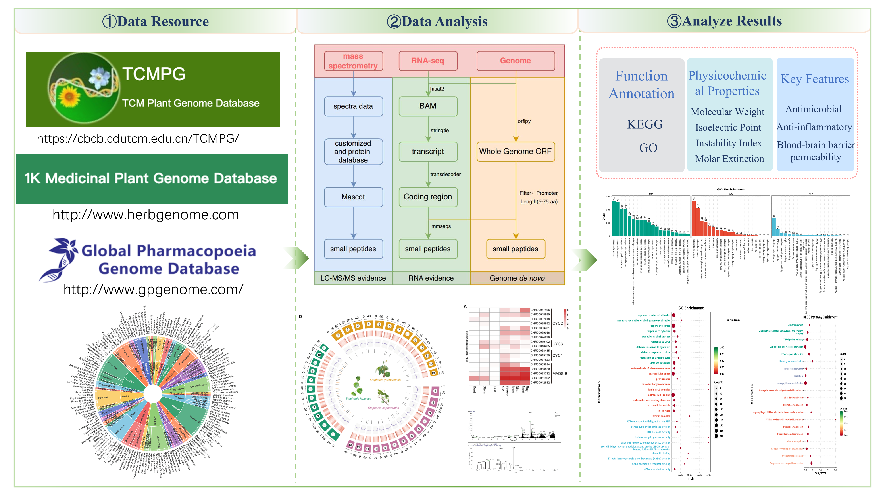

# Data Processing Pipeline for Small Peptides



## Pipeline Workflow

### 1. Data Download

Retrieve datasets from the following sources:

- [NCBI](https://www.ncbi.nlm.nih.gov/)
- [1K-MPGD](http://www.herbgenome.com/)
- [TCMPG](https://cbcb.cdutcm.edu.cn/TCMPG/)
- [GPGD](http://www.gpgenome.com)

### 2. Annotation of small peptides

#### Genome-Wide Prediction of Small Peptides

- The genome-wide prediction of small peptides was performed using a six-frame translation approach implemented in EMBOSS (http://emboss.open-bio.org) and ORFIPY (https://github.com/urmi-21/orfipy), generating all possible protein-coding sequences extending from termination codons. Filtering criteria were applied to retain sequences ranging from 5 to 75 amino acids in length.
- To predict small peptides from genomic data, run the following command:

```
nextflow run 01.genome_de_novo/all_orf.nf -with-trace -resume --queueq xhhctdnormal --genome_dddir ../../genome/ -qs 30
```

- Replace `../../genome/` with the path to the genome files. Results will be outputted to `Result/01.orf/*/*.peptide*.fa`.

#### Transcriptomic Prediction of Small Peptides

- Transcriptome data from the NCBI Sequence Read Archive (https://www.ncbi.nlm.nih.gov/sra) were aligned to their corresponding reference genomes using HISAT2 (https://daehwankimlab.github.io/hisat2/). Reconstructed transcripts were processed with StringTie (https://github.com/gpertea/stringtie), and coding sequences were identified using TransDecoder (https://github.com/TransDecoder/TransDecoder). The mmseq2 (https://github.com/soedinglab/MMseqs2, Version: Release 17-b804f) was used to compare transcriptome-annotated proteins with genome-predicted small peptides, generating a small peptide dataset supported by transcriptome data.
- To predict small peptides from transcriptomic data, run the following command:

```
nextflow run 02.RNA-seq_prediction/transcript.nf -with-trace -resume -profile slurm_docker --queueq all.q --run_small y --genome genome.fa --sample_name Plants --data_set NGS --NGS_data rna2nd --split_trans n --fastp_cpu 16 --fastqc_cpu 16 --hisat2_build_cpu 16 --hisat2_cpu 16 --NGS_samtools_cpu 8 --NGS_stringtie_cpu 16 --nf_tmp result
```

- Replace `genome.fa` with the genome file and `rna2nd` with the RNA-seq input directory. Results will be outputted to `result/03.Transcript/gff/amino_acids_5_75/`.

#### Mass spectrometry identity of Small Peptides

- Mass spectrometry data were incorporated to enhance the confidence of predicted small peptides. Experimentally derived small peptide sequences were compared against the genome- and transcriptome-predicted datasets using BLASTp (https://blast.ncbi.nlm.nih.gov/BlastAlign.cgi), and peptides with significant sequence matches were retained as high-confidence candidates.

### 3. Functional annotation of small peptides

#### Functional Annotation of Small Peptides

- The functional characterization of small peptides was performed through comparative analyses against established protein function and pathway databases. KEGG pathway annotations were assigned using HMMSCAN (https://www.ebi.ac.uk/Tools/hmmer/search/hmmscan), enabling the identification of metabolic and signaling pathways associated with these small peptides. Functional classification was further refined through sequence homology searches against the UniProt database using BLASTp, providing insights into potential biological roles and molecular interactions.

- To annotate the function of small peptides, run the following command:

```
nextflow run 03.function_annotation/all_fun.nf -with-trace -resume --queueq xhhctdnormal --genome_dddir ../../genome/ -qs 30
```

- Replace `../../genome/` with the path to the genome files. Results will be stored in the specified output directory.

- To evaluate the physicochemical properties of small peptides, including pH, optical rotation, and isoelectric point, predictions were conducted using the ProtParam module within Bio.SeqUtils (https://biopython.org/docs/1.75/api/Bio.SeqUtils.html).

#### Prediction of Antimicrobial Peptides

- The prediction of antimicrobial peptides utilizes the iAMPCN tool (https://github.com/joy50706/iAMPCN) with default parameters. Below is the workflow to run the pipeline:

```
nextflow run 04.Antimicrobial_peptide_prediction/iAMPCN.nf -qs 400 -resume -with-trace --input_dir 00.data/ --pred_threshold 0.98 --high_cpu 16
```

#### Prediction of anti-inflammatory Peptides

- Anti-inflammatory peptide prediction uses the PepNet (https://github.com/hjy23/PepNet) tool with default parameters. Below is the command to run the pipeline:

- Download the pre-trained database (ProtT5-XL-U50):

```
wget https://huggingface.co/Rostlab/prot_t5_xl_uniref50/tree/main
tar -zxvf datasets.tar.gz
```

- Run the prediction code for anti-inflammatory peptides. Update the `PepPath` in `run_Aip.py` to the PepNet installation path:

```
python run_Aip.py ${inputFa} ${outdir}
```

### Blood–Brain Barrier Peptide Prediction

- The prediction of blood-brain barrier peptides uses the DeepB3P (https://github.com/GreatChenLab/DeepB3P) model. Update `deepB3P/model/deepb3p.py` to support CPU execution:

```
# Original Code
self.model.load_state_dict(torch.load(directory))

# Modified Code for CPU
self.model.load_state_dict(torch.load(directory,map_location=torch.device('cpu')))
```

- Run the pipeline using the following commands:

```shell
# Clean sequences by removing invalid characters like "*" and "X"
bash run.1.clean.sh
# Split sequences for parallel processing
bash run.2.split.sh
# Generate commands for execution
bash run.3.get_all.sh
# Execute in parallel
bash run.5.paralleltask.sh
# Merge and analyze results
python run.6.merge.py
python run.7.stat.py 0.5
python run.7.stat.py 0.8
```

## Repository Structure

- `01.genome_de_novo/`: Directory containing scripts for predicting small peptides from genomic data.

  - `README.txt`: Instructions for running the genome de novo pipeline.
  - `all_orf.nf`: Nextflow script for predicting small peptides.
  - `bin/`: Directory containing additional scripts like `PepFilter.py`.

- `02.RNA-seq_prediction/`: Directory containing scripts for predicting small peptides from transcriptomic data.

  - `README.txt`: Instructions for running the RNA-seq prediction pipeline.
  - `transcript.nf`: Nextflow script for processing RNA-seq data.
  - `bin/`: Directory containing helper scripts for transcriptomic data processing (e.g., `fastp_stats.py`, `filter_seq.py`, `get_final_gtf.py`).

- `03.function_annotation/`: Directory containing scripts for annotating the function of small peptides.

  - `README.txt`: Instructions for running the functional annotation pipeline.
  - `all_fun.nf`: Nextflow script for functional annotation.
  - `all_fun.py`: Python script for annotating small peptides.
  - `bin/`: Directory containing various annotation scripts for functions like KEGG, UniProt, and Pfam.

- `04.Antimicrobial_peptide_prediction/`: Directory for predicting antimicrobial peptides.

  - `iAMPCN.nf`: Nextflow script for antimicrobial peptide prediction.
  - `bin/`: Additional helper scripts (e.g., `Merge.py`, `filt_pep.py`).

- `05.Anti-inflammatory_peptide_prediction/`: Directory for predicting anti-inflammatory peptides.

  - `run_Aip.py`: Main script for running predictions.

- `06.Blood–brain_barrier_peptide_prediction/`: Directory for predicting blood-brain barrier peptides.

  - `bin/`: Helper scripts for sequence cleaning, splitting, parallel execution, and result merging.

- `img/`: Directory containing images used in the pipeline documentation (e.g., `banner.png`).

## Dependencies

### Genome-Wide Prediction

- Python 3
- Nextflow
- ORFIPY
- CD-HIT

### RNA-Seq Prediction

- Docker
- Python 3
- Nextflow
- Dos2Unix
- Fastp
- HISAT2
- Samtools
- Minimap2
- SMRT Link
- StringTie
- TransDecoder

### Functional Annotation

- NCBI-BLASTp
- Diamond
- HMMSCAN
- KOFAM Database
- UniProt Database
- Other tools as specified in the annotation scripts

### Antimicrobial Peptide Prediction

- seqkit
- iAMPCN
- Python libraries: pandas, matplotlib, seaborn, numpy, biopython, tqdm, scikit-learn
- Nextflow

### Anti-inflammatory Peptide Prediction

- PepNet
- Python libraries: torch, torchvision, torchaudio

### Blood-Brain Barrier Peptide Prediction

- DeepB3P
- Python libraries: pandas, dgl, numpy, scikit-learn
